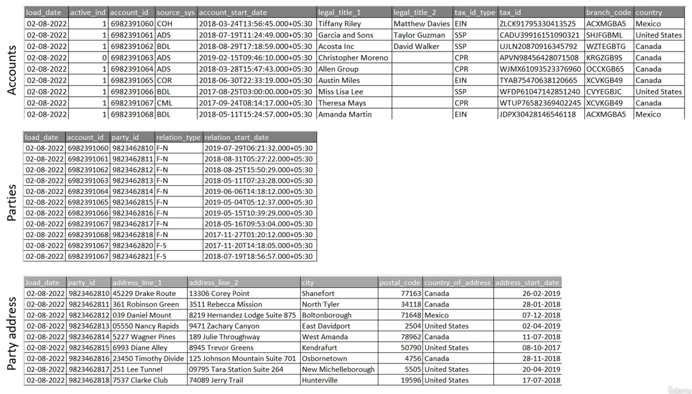
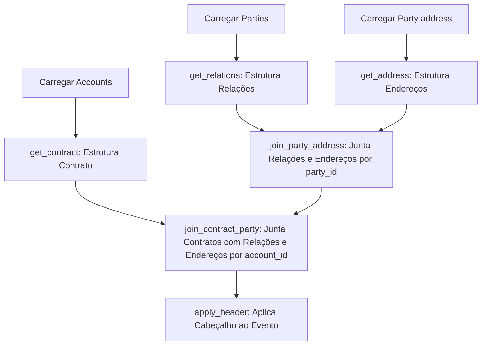

### Estrutura e Componentes

1. **Definições Iniciais**:
    - O código começa definindo algumas variáveis:
        - `job_run_env`: Define o ambiente de execução do job (ex.: `LOCAL`).
        - `load_date`: Data da execução do pipeline.
        - `job_run_id`: Gera um identificador único (`UUID`) para execução.

2. **Configurações e Hive**:
    - A configuração do ambiente é carregada através do método `ConfigLoader.get_config()`.
    - O valor de `enable_hive` é obtido e usado para determinar se o Hive será ativado ou não. Isso implica que a sessão Spark não estará interagindo com uma instância de Hive, quando `job_run_env` estiveer configurado como `LOCAL`.

4. **Sessão Spark**:
    - A sessão Spark é inicializada por meio de `Utils.get_spark_session(job_run_env)`. Aqui, o job é configurado para o ambiente definido, possibilitando o processamento distribuído.

5. **Leitura de Dados**:
    - São lidos três conjuntos de dados:
        - `accounts_df`: DataFrame de contas.
        - `parties_df`: DataFrame de partes (clientes ou entidades associadas).
        - `address_df`: DataFrame de endereços.
    - Esses dados são provavelmente extraídos de um banco de dados ou arquivos e podem ser processados de forma distribuída pelo Spark.

6. **Transformações**:
    - A partir dos DataFrames lidos, o código aplica transformações específicas:
        - `contract_df`: Cria um DataFrame de contratos a partir dos dados de contas.
        - `relations_df`: Define relações a partir dos dados de partes.
        - `relation_address_df`: Relaciona endereços.
        - A etapa de junção dos DataFrames (`party_address_df` e `data_df`) agrega os dados de contas, partes e endereços.
        - O método `apply_header` parece adicionar algum tipo de cabeçalho ou metadados aos dados processados.
7. **Envio para Kafka**:
    - O código prepara o DataFrame final (`final_df`) para ser enviado ao Kafka.
    - Ele cria um DataFrame `kafka_kv_df` que contém as colunas `key` e `value`. A `key` é obtida do identificador do contrato, e o valor é o JSON de toda a linha do DataFrame, criado pela função `to_json(struct("*"))`.

8. **Configuração de Kafka**:
    - As configurações de Kafka, como servidores e parâmetros de segurança (protocolos, chaves, etc.), são recuperadas do arquivo de configuração (`conf`).
    - É utilizado o formato `kafka` do Spark para enviar os dados para o tópico Kafka. O job utiliza o protocolo de segurança SASL com o mecanismo `PLAIN`, e as credenciais (`api_key`, `api_secret`) são inseridas dinamicamente.

10. **Conclusão**:
    
    - Finalmente, os dados são enviados para o Kafka. Após o envio, uma mensagem de conclusão é registrada no log.

### Fluxo de Dados e Combinações:

1. **Carregamento de Contas, Relações e Endereços**:
    - O processo começa com o carregamento dos dados de três fontes principais: **Accounts**, **Parties** (entre contas e partes), e **Party address** (das partes relacionadas).

2. **Transformações de Cada Dataset**:
    - **Accounts**: A função `get_contract` transforma os dados de contas, criando uma estrutura que encapsula informações como título legal, identificador fiscal, data de início, entre outros.
    - **Parties**: A função `get_relations` estrutura as relações entre as contas e as partes, como tipo de relacionamento e data de início.
    - **Party address**: A função `get_address` transforma os endereços das partes em uma estrutura padronizada que inclui linha de endereço, cidade, código postal e país.

3. **Junção de Relações e Endereços**:
    - A função `join_party_address` junta as **Parties** com os **Party address** correspondentes. Essa junção é feita com base no `party_id` e o resultado é agrupado por `account_id`, gerando um DataFrame que contém as **relações e os endereços** de cada parte envolvida com a conta.

4. **Junção de Contratos e Relações/Endereços**:
    - A função `join_contract_party` combina os dados de **contratos** (gerados pela transformação das contas) com os dados de **relações e endereços**. Essa junção é feita com base no `account_id`, resultando em um DataFrame unificado com todas as informações de uma conta, suas relações, endereços e contratos.

5. **Criação de Evento com Cabeçalho**:
    - Finalmente, a função `apply_header` aplica um cabeçalho ao DataFrame consolidado, criando uma estrutura de evento que contém metadados como identificador do evento, tipo de evento, e data.

### Diagrama de Fluxo Mermaid:

Fontes de dados de entrada

### Explicação detalhada:

- **Contas, Relações e Endereços**: Todos esses dados são carregados separadamente e passam por transformações para padronizar as estruturas. A transformação inclui encapsular informações em estruturas que identificam as operações realizadas (inserção de novos valores).
    
- **Combinação de Relações e Endereços**: As informações das relações e seus respectivos endereços são combinadas utilizando o `party_id` como chave de junção. O resultado é uma estrutura que agrupa todas as partes relacionadas e seus endereços por conta.
    
- **Combinação de Contratos com Relações/Endereços**: A junção final é feita entre os dados de contratos (gerados a partir das contas) e as relações/endereços, criando um DataFrame que contém todas as informações sobre uma conta, suas partes relacionadas e os endereços.
    
- **Cabeçalho e Criação de Evento**: Depois que os dados são combinados, é adicionado um cabeçalho ao evento, com informações de metadados como UUID do evento e data de criação.
    

Essa sequência mostra claramente como os dados são carregados separadamente, transformados e finalmente combinados. Se precisar de mais detalhes ou ajustes, estou à disposição!

